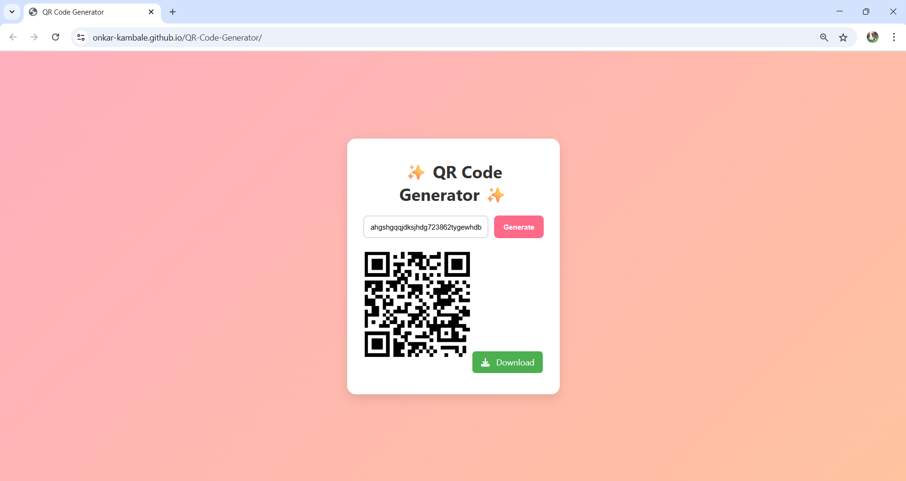

# ✨ QR Code Generator

A modern and interactive **QR Code Generator** web app built using **HTML, CSS, and JavaScript**. Simply enter any text or URL, click "Generate", and download your custom QR code instantly!

---

## 🚀 Features

- 🔹 Generate QR codes for URLs, text, phone numbers, and more
- 🎨 Beautiful and responsive UI with animations
- 🖱️ Instant QR preview on generation
- ⬇️ Downloadable QR image
- 📱 Mobile-friendly

---

## 🛠️ Tech Stack

- **HTML5** – Semantic and accessible structure
- **CSS3** – Custom styles, animations, hover effects
- **JavaScript (Vanilla)** – Dynamic QR code generation and interactivity
- **[QRServer API](https://goqr.me/api/)** – Free external API to generate QR code images

---

## 🌐 Live Demo
🔗 https://onkar-kambale.github.io/QR-Code-Generator/

---

## 📥 How to Use
1. Type any text or URL in the input field
2. Click on the "Generate" button
3. View the QR code
4. Click the "Download" button to save the image.

---
 
## 📄 License
This project is licensed under the MIT License.
